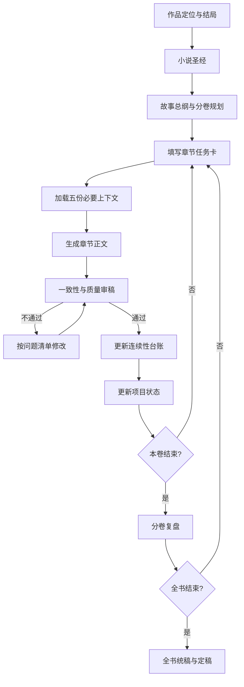

# AI 小说创作工作流

这套工作流的目标只有一个：让 AI 每次只写当前章节，同时始终服从整本书的核心设定、故事总纲和已发生事实。

## Skill 调用

项目已包含 [`skills/write-novel/SKILL.md`](skills/write-novel/SKILL.md)。当前未安装到全局目录时可这样调用：

```text
使用 E:\万卷浮生\ChatGPT小说\skills\write-novel\SKILL.md，按当前项目状态继续下一步。
```

安装到 Codex Skills 目录后可直接使用：

```text
使用 $write-novel 写下一章。
使用 $write-novel 审核第 12 章。
使用 $write-novel 定稿当前章节并更新台账。
```

## 快速开始

1. 填写 [`01_小说圣经/小说圣经.md`](01_小说圣经/小说圣经.md)：确定题材、主题、世界规则、角色底线和结局方向。
2. 填写 [`02_故事规划/故事总纲.md`](02_故事规划/故事总纲.md)：先写结局，再拆分卷、阶段和章节目标。
3. 初始化章节：

   ```powershell
   .\scripts\new-chapter.ps1 -Number 1 -Title "章节标题"
   ```

4. 填写新章节目录中的 `任务卡.md`，再把 [`04_提示词/写章提示词.md`](04_提示词/写章提示词.md) 交给 AI。
5. 用 [`04_提示词/审章提示词.md`](04_提示词/审章提示词.md) 审核，把结果写入本章 `审稿.md`。
6. 通过审核后，更新 [`02_故事规划/连续性台账.md`](02_故事规划/连续性台账.md) 和 [`00_项目管理/项目状态.md`](00_项目管理/项目状态.md)，再开始下一章。
7. 随时运行自检：

   ```powershell
   .\scripts\check-workflow.ps1
   ```

   修改模板或脚本后运行完整测试：

   ```powershell
   .\scripts\test-workflow.ps1
   ```

## 文件职责

| 文件 | 只负责什么 | 何时更新 |
|---|---|---|
| `小说圣经.md` | 不轻易变化的作品规则 | 立项时；重大变更获批后 |
| `故事总纲.md` | 从结局倒推的主线、分卷和章节目标 | 规划期；结构调整时 |
| `连续性台账.md` | 已经写进正文的事实 | 每章定稿后 |
| `项目状态.md` | 当前写到哪里、下一步是什么 | 每次工作结束时 |
| `任务卡.md` | 当前一章必须完成的叙事任务 | 写章前 |
| `正文.md` | 章节正文 | 写作与修改时 |
| `审稿.md` | 问题、证据和修改结论 | 审章时 |

## 防跑题规则

资料冲突时按以下优先级处理：

1. 已定稿正文与连续性台账中的既成事实
2. 小说圣经中的硬规则
3. 故事总纲中的主线与结局约束
4. 当前章节任务卡
5. AI 的临场发挥

低优先级内容不得静默覆盖高优先级内容。发现冲突时停止扩写，在任务卡或审稿中标记 `【待确认】`。

## 整体流程



## AI 每章只加载这些内容

按顺序提供给 AI，避免把整个项目塞进上下文：

1. `00_项目管理/项目状态.md`
2. `01_小说圣经/小说圣经.md`
3. `02_故事规划/故事总纲.md` 中与当前卷、当前章直接有关的部分
4. `02_故事规划/连续性台账.md`
5. 当前章节的 `任务卡.md`

如需承接语言或场景，再附上一章末尾；不要用未定稿草稿覆盖台账事实。
